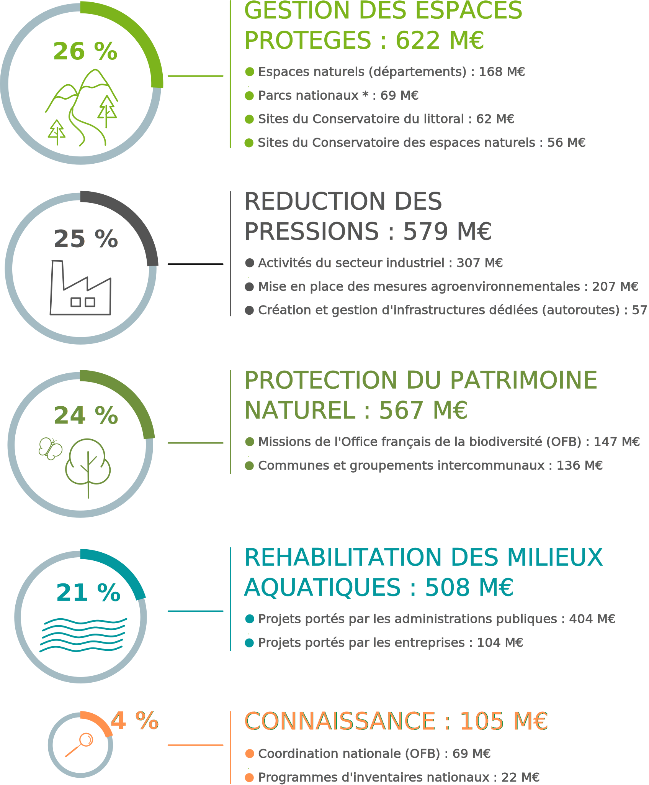
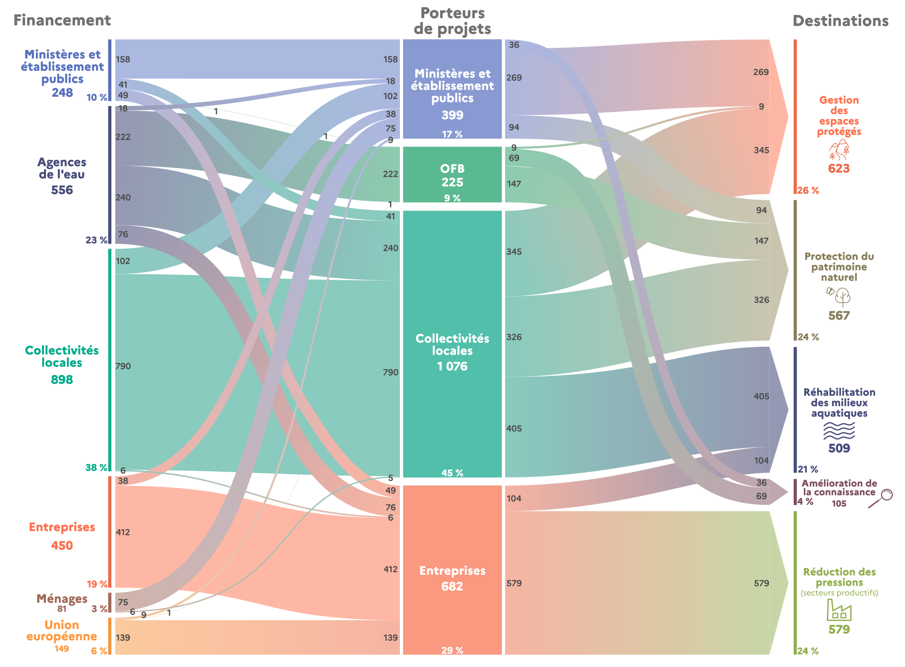

---
author:
  - name: Elodie RICAUD
    affiliation: SDES
title: "Quelles réponses économiques face au déclin de la biodiversité ?"
subtitle: "La dépense nationale de protection de la biodiversité et des paysages"
shorttitle: "**Quelles réponses économiques face au déclin de la biodiversité ?**<br>La dépense nationale de protection de la biodiversité et des paysages"
abstract: |
  The abstract of the article.
# at least one keyword must be supplied
keywords: [keywords, not capitalized, "[Java]{.proglang}"]
links-to-footnotes: true
paged-footnotes: true
bibliography: index.bib
output: 
  pagedown::jss_paged:
    css:
      - jss-fonts
      - jss-page
#      - jss
      - cgdd-page.css
      - cgdd-style.css
    self_contained: false
# uncomment this line to produce HTML and PDF in RStudio:
# knit: pagedown::chrome_print
---


```{r setup, include=FALSE, results='hide', message=FALSE, warning=FALSE}

knitr::opts_chunk$set(echo=FALSE,
                      warning=FALSE,
                      message=FALSE)

library(here)

```


.date[Septembre 2021]

En 2018, 2,4 milliards d’euros ont été consacrés à la protection de la biodiversité et des paysages sur le territoire national. Cette dépense se répartit, à parts sensiblement égales, entre le développement des aires protégées, la réduction des pressions sur les milieux naturels, la protection du patrimoine naturel et la réhabilitation des milieux aquatiques. Les collectivités locales sont les premiers financeurs de la protection de la biodiversité en France.

L’effort financier en faveur de la biodiversité est mesuré par la dépense nationale de protection de la biodiversité et des paysages (encadré 1). Calculé chaque année, selon les concepts et principes de la comptabilité nationale, cet indicateur retrace l’ensemble des dépenses effectuées par les acteurs économiques (État, collectivités locales, entreprises et ménages) pour développer la connaissance, réhabiliter les écosystèmes, réduire les pressions ou préserver les espèces menacées.

### 2,4 milliards d'euros alloués à la biodiversité en 2018

En 2018, la dépense nationale de protection de la biodiversité et des paysages est évaluée à 2,4 milliards d’euros (Md€ – valeur en euros courants) – (graphique 1). Elle progresse en moyenne de 4 % par an entre 2000 et 2018, un rythme nettement supérieur à celui de l’inflation (+ 1,6 %). 
En 2004, dans le cadre de la première stratégie nationale pour la biodiversité (2004-2010), la France a renforcé l’intégration des enjeux de biodiversité dans le champ de toutes les politiques publiques. À la suite du Grenelle de l’environnement en 2007, un ensemble de mesures visant à préserver les espèces et leurs habitats a été adopté. Les politiques publiques en faveur de la biodiversité se sont poursuivies au cours de la décennie 2010, avec la seconde stratégie nationale pour la biodiversité (2011-2020), puis l’adoption de la loi pour la reconquête de la biodiversité, de la nature et des paysages en 2016, suivie du plan biodiversité en 2018.

[ENCADRE 1]
La dépense de protection de la biodiversité et des paysages

La dépense de protection de la biodiversité et des paysages répond à un cadre précis de la classification des activités et dépenses de protection de l'environnement. Les actions et activités en faveur de la biodiversité regroupent les services liés à la gestion des espaces et des espèces (création/gestion de zones protégées, conservation in situ, lutte contre les espèces exotiques envahissantes), à la réduction des pressions (mesures agro-environnementales et dépenses de prévention des dommages causés par l’industrie et les transports) et à la connaissance (inventaires et expertises relatives au patrimoine naturel). 

Ces engagements se sont traduits par une hausse des moyens financiers engagés en faveur de la biodiversité et des paysages. Entre 2000 et 2013, les dépenses ont ainsi doublé en euros courants (+ 54 % en euros constants), avant de se stabiliser entre 2013 et 2017, puis de repartir à la hausse en 2018 (+ 4,8 %). 
Néanmoins, la protection de la biodiversité ne représente que 5 % des dépenses de protection de l’environnement en 2018 (51 Md€), largement dominées par la gestion des déchets  (38 %) et des eaux usées (26 %).

```{r figure 1, fig.width=7}
source("./datalab_256_figure1.R")

figure1
```


En 2018, 26 % des dépenses liées à la biodiversité portent sur les activités dédiées au déploiement et à la gestion du réseau des aires protégées (622 millions d’euros – M€ – valeur en euros courants) – (figure 2). Dans le cadre de ses engagements nationaux et internationaux, la France étend progressivement son réseau d’espaces protégés. Au 1er janvier 2021, 24 % du territoire national (terrestre et maritime) est couvert par des surfaces protégées. La stratégie nationale des aires protégées, adoptée le 12 janvier 2021, a pour objectif de porter cette part à 30 % du territoire d’ici 2022.


### La réduction des pressions exercées sur la biodiversité...

Avec 579 M€ en 2018, les actions engagées par les secteurs productifs (industrie, agriculture et transport) constituent le deuxième poste de dépenses (25 %) (figure 2). Ces actions sont destinées à prévenir et réduire les pressions causées par les activités humaines (protection des continuités écologiques, prévention de la pollution, etc.), réparer les dommages causés aux paysages et à la biodiversité (réhabilitation de mines ou de carrières, etc.) ou compenser les atteintes à la biodiversité (création de barrières vertes et paysagères par exemple). Le secteur industriel concentre 53 % de ces dépenses (307 M€).


### ... et la préservation du patrimoine naturel et des milieux aquatiques

L’autre moitié des dépenses de protection de la biodiversité se répartit entre, d’une part, les actions de la préservation du patrimoine naturel (567 M€), qui recouvrent la mise en œuvre de plans de restauration et de réintroduction d’espèces menacées, la protection des grands prédateurs (loups, ours et lynx) ou la lutte contre les espèces exotiques envahissantes, et d’autre part, celles relatives à la réhabilitation des milieux aquatiques (508 M€) – (figure 2). Ces dernières visent à restaurer la continuité écologique, réhabiliter les cours d’eau et les milieux humides et à lutter contre l’érosion de la biodiversité aquatique. 

Le développement de la connaissance et de la recherche sur  la biodiversité et les paysages représente une part marginale de la dépense nationale (105 M€). Ce domaine comprend les systèmes d’information sur la biodiversité et les programmes d’inventaires nationaux, tels que l’inventaire national du patrimoine naturel (INPN) ou l’inventaire des zones naturelles d'intérêt écologique, faunistique et floristique (Znieff).


### Les collectivités locales, acteurs indispensables de la protection de la biodiversité

Fortes de leurs compétences en matière d’environnement et d’aménagement du territoire, les collectivités locales jouent un rôle prépondérant dans la protection de la biodiversité. Elles accompagnent des programmes de maintien et de diversification de la faune et de la flore, réalisent des inventaires du patrimoine naturel et participent à la restauration des écosystèmes dégradés. Elles assurent également la gestion de zones de protection spécifiques, telles que les espaces naturels sensibles pour les départements ou les réserves naturelles régionales pour les régions. En 2018, elles ont ainsi consacré 1 076 M€ en faveur de la biodiversité, soit 45 % de la dépense totale de protection de la biodiversité (figure 3). Ces dépenses sont financées principalement par leurs budgets (73 %) et les aides des agences de l’eau (22 %).





Parallèlement, en 2018, les moyens mobilisés par l’État ne représentent que 26 % des dépenses. Ils permettent notamment de financer des projets tels que les plans de réintroduction d’espèces et de protection des grands prédateurs (loups, ours et lynx) ou encore la lutte contre les espèces exotiques envahissantes (stratégie nationale relative aux espèces exotiques envahissantes).


### L'OFB, un interlocuteur dédié à la sauvegarde de la biodiversité

L’Office français de la biodiversité (OFB) contribue aux objectifs et aux orientations de reconquête de la biodiversité, adoptés par la France en 2016. Il assure un appui à la mise en œuvre des politiques publiques de protection de la biodiversité, accompagne les acteurs et les collectivités dans leurs projets de territoire et conduit des actions de sensibilisation à la biodiversité. Il participe également à l’amélioration de la connaissance, en coordonnant le système national d’information sur la biodiversité et en finançant les communes et structures intercommunales dans la réalisation de leur atlas de la biodiversité communale (inventaire des milieux et espèces présents sur un territoire donné). En 2018, l’OFB a ainsi mobilisé 225 M€, financés majoritairement par les agences de l’eau (98 %) – (figure 3).

### La participation du secteur privé à l'effort de protection

En 2018, les entreprises ont alloué 682 M€ à la protection de la biodiversité, montant abondé à hauteur de 20 % par des fonds européens et 11 % par les agences de l’eau, dans le cadre de la mise en œuvre des mesures agro-environnementales (figure 3). Les  ménages apportent un financement à hauteur de 80 M€, soit 3 % des dépenses totales en 2018. Cet effort financier prend la forme notamment de dons ou de cotisations auprès d’associations de protection de la nature1. 


[NBP 1]

Ce bilan comptable ne prend pas en compte la valorisation monétaire du bénévolat, qui dépasse les 3 M€.





### Les fonds européens orientés vers l'agroécologie

L’essentiel du financement européen est orienté vers la mise en œuvre des mesures agro-environnementales via le Fonds européen agricole pour le développement rural. Dans une moindre mesure, d’autres programmes territoriaux sont également soutenus par l’Union européenne, notamment le programme européen de financement LIFE-Nature qui a pour ambition d’accompagner la mise en place des directives « Habitats » et « Oiseaux »

[ENCADRE 2]

Protection de la biodiversité : quelle implication de la France au niveau international ?

Dans le cadre de la Convention sur la diversité biologique (CDB), la France soutient des projets innovants en faveur de la biodiversité dans les pays en développement. Ces initiatives sont portées par le Fonds français pour l’environnement mondial et l’Agence française de développement. En 2018, 477 M€ ont ainsi été versés au titre de l’aide publique au développement liée à la biodiversité, un chiffre largement supérieur à l’objectif de 211 M€ fixé par la CDB. Ces financements internationaux viennent s’ajouter aux 2,4 Md€ mobilisés sur le territoire national. Parmi les projets soutenus figurent la gestion du Parc national de Mohéli aux Comores ou la restauration des zones humides de Qixian en Chine.

