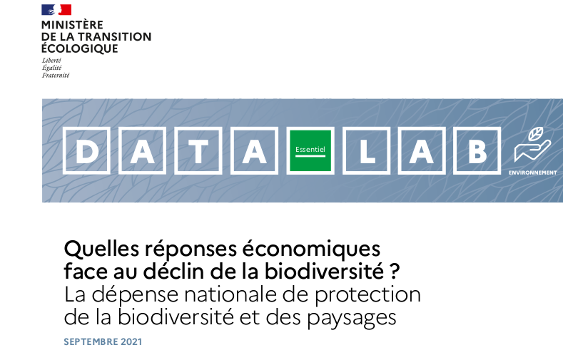
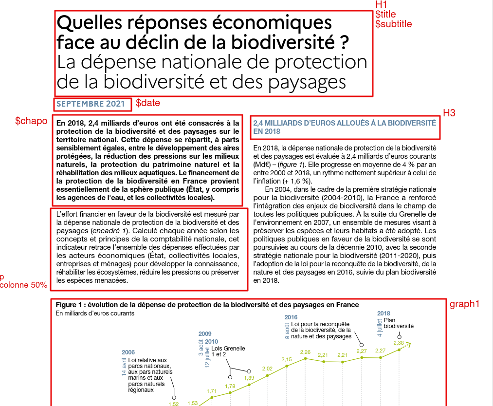
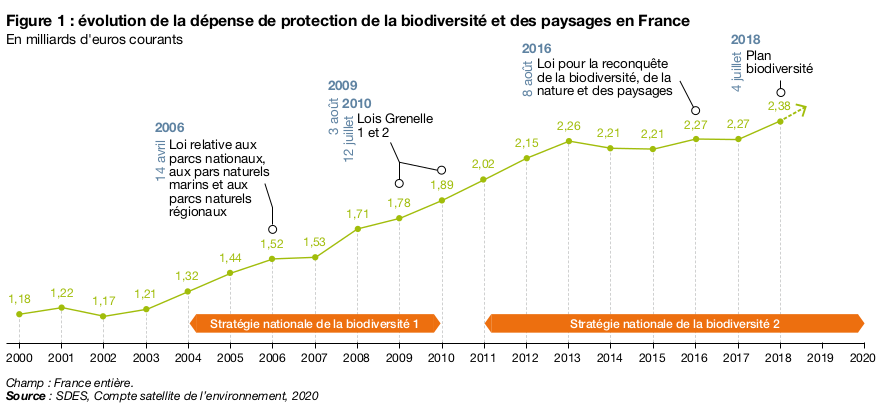

layout: true
  

`r paste0("<div class='my-footer'><span>", params$event, "</span> <center><div class=logo></center></span></div>")` 


<style type="text/css">


</style>


---

class: inverse, center, middle

```{r setup, include=FALSE, results='hide', message=FALSE, warning=FALSE}

knitr::opts_chunk$set(echo=FALSE,
                      warning=FALSE,
                      message=FALSE)

library(here)


```

---

class: inverse, center, middle

# I. Preuve de concept

---

### Objet à reproduire

.center[

]

---

### Méthodologie

.pull-left[**Analyse de la structure**

Nous avons tout d'abord étudié la structure de la publication pour isoler deux informations :

1. les données clefs mise en page de manière spécifique (titre, sous-titre, date, auteur, etc.) ;
2. les marqueurs de style et de mise en page (format de titre, colonnes, intertitres, encadrés, etc.).


]

.pull-right[**Mise à plat des éléments textuels**

Nous appuyant sur le document source du PDF, nous avons *mise à plat* le texte pour en isoler les éléments de manière cohérente :

* titraille ;
* texte principal ;
* encadré.

Nous préparons ainsi le **document source** qui servira de matériau de base à notre pipeline.

]

---

### Boîte à outils : R, Rmarkdown, `{pagedown}`

Notre démarche s'appuie sur un ensemble de solutions techniques complémentaires :
1. `R` : langage d'usage courant, il bénéficie d'une très grande versatilité grâce à une communauté riche et aux compétences variées. Ce langage dispose notamment de librairies riches et puissantes en traitement et visualisation de données ;
2. `R Markdown` : déclinaison du langage de mise en forme markdown, le Rmarkdown permet une mise en page discrète du texte et l'usage de nombreux outils de production de format textuel ;
3. `{pagedown}` : librairie bâtie sur R Markdown permettant la production de documents imprimables totalement paramétrables grâce à des technologies issues du web.

---

### Visualisation

Suivant la proposition du client, nous avons reproduit la figure 1 avec la librairie R `{ggplot}`.

.pull-left[


]

.pull-right[
```{r figure1, fig.height=3.5}

source("../cgdd_poc_datalab_256/datalab_256_figure1.R")

figure1
```

]

Nous avons pu reproduire la plupart des spécificités du graph à l'aide de ses fonctions ainsi que d'autres librairies développées par la communauté :

* mise forme des textes et légendes (`{ggtext}`) ;
* adaptation des légendes et échelles (`{lemon}`) ;
* annotation des données (`{ggforce}`) ;
* etc.

---

### Production du document

.pull-left[**En entrée**
Le package `{pagedown}` permet de produire un document personnalisé grâce à plusieurs types de fichier :

1. un fichier textuel contenant les éléments rédactionnels ;
2. un ou plusieurs fichiers R pour produire la ou les dataviz ;
3. des fichiers images pour les illustrations et logos ;
4. des fichiers de style pour spécifier la mise en forme ;
5. un fichier de structure pour spécifier la mise en page.
]

.pull-right[**En sortie**
`{pageodown}` produit en sortie deux fichiers au contenu similaire mais de format différent :

1. **un document texte partageable au format PDF** paginé, numéroté et imprimable au format brochure ;
2. **un fichier HTML** permettant la publication direct sous forme de page web.

Les deux documents sont générés simultanément à l'exécution de pagedown.

]


---

### Résultat

---

class: inverse, center, middle

# II. Sources d'inspiration

---

### S'approprier {pagedown} (RR2020)

---

### Créer son style et l'appliquer (UNHCR)

---

### Automatiser la publication (RPLSS)


---

### Créer son propre package (ThinkR)

---


class: inverse, center, middle


# III. Un pipeline de publication

---

## Organisation générale

---


---

### Production textuelle

* spécificité Rmd
* chemin de la copie

/

Bénéfices
* lisibilité
* faible montée en compétence requise
* circuit de la copie amont

---

### Production visuelle

* fichiers acceptés
* fichiers à produire
* compétences disponibles (questionnaire)
/
Bénéfices
* possibilité d'automatisation
* stabilité du style
* possibilité de templatisation
* possibilité de packagisation

---

### Maquette

* contraintes techniques (HTML/CSS)
* compétences disponibles (questionnaire)
/
Bénéfices
* rapidité d'exécution
* modularité
* adaptabilité

---

### Création des styles

* contraintes techniques (CSS/JS)
* ressources
* organisation
* compétences disponibles (questionnaire)
/
Bénéfices
* stabilité
* cohérence visuelle
* automatisme
* versatilité


---

class: inverse, center, middle

# Merci !

Contact : [sylvain@datactivist.coop](mailto:sylvain@datactivist.coop)
