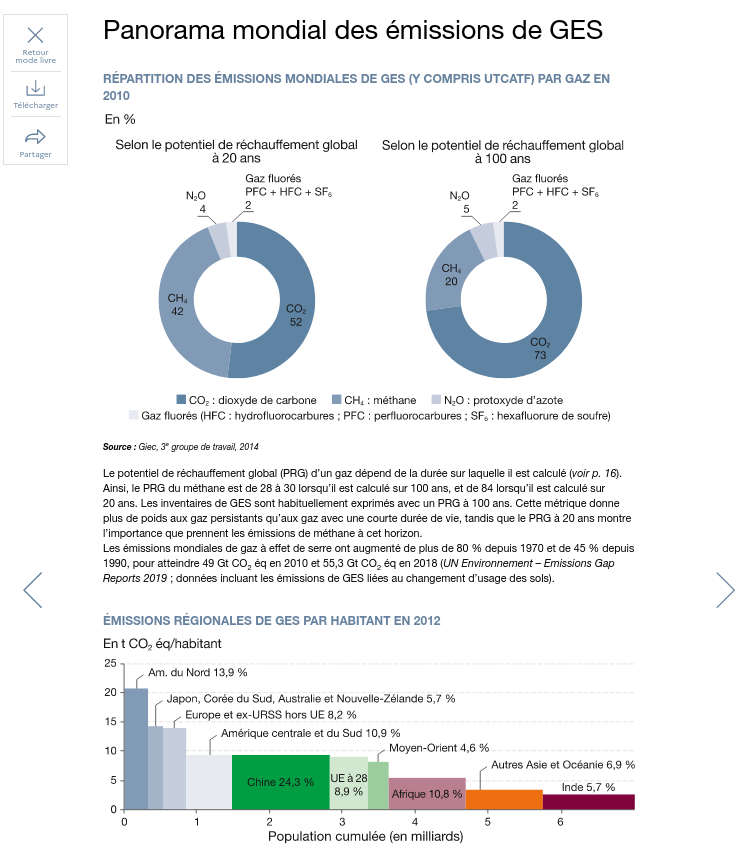

layout: true
  

`r paste0("
", params$event, " 

")` 

---

class: inverse, center, middle

# Contexte

---

### Notre compréhension du besoin

---

## Notre objectif

---

class: inverse, center, middle

# Objets numériques

---

class: inverse, center, middle

## I. Objets numériques - exemples emblématiques

---

### Les articles numérisés
📺 Le Monde Diplomatique - Cartes : Faillite de l’ethnofédéralisme éthiopien (07/2021) ;
https://www.monde-diplomatique.fr/cartes/ethiopie-ethnofederalisme

---

### Les rapports interactifs

🏛️ Ipedis - Publispeak RATP 
https://www.ipedis.com/nos-realisations
https://ratp.publispeak.com/essentiel-2019/article/C1/

🏛️ République d'Estonie - Agence de l'environnement (Estonie) : Environment of the city of Tartu (2018)
https://keskkonnaagentuur.ee/en
https://www.arcgis.com/apps/MapJournal/index.html?appid=7ae5364a9d6e4b70a7f181308c738776#

---

### Les vidéos de vulgarisations

    📺 France Télévisions Slash - #DATAGUEULE (depuis 2016) ;
    https://youtube.com/datagueule
    
    📺 Le Monde : Pourquoi le climat se réchauffe ? ;
    https://www.youtube.com/watch?v=T4LVXCCmIKA
    📺 Kurzgesagt (Allemagne) - How to terraform Venus (quickly).
    https://www.youtube.com/watch?v=G-WO-z-QuWI
    
---

### Les podcasts de vulgarisation scientifiques

    📺 France Culture - Les cours du Collège de France ;
    https://www.franceculture.fr/emissions/les-cours-du-college-de-france
    
    📺 Nature Podcast (Royaume-Uni) : The coronapod ;
    https://www.nature.com/nature/articles?type=nature-podcast
    https://www.nature.com/articles/d41586-021-02053-0
    
    📺 BBC Radio 4 - More or less (Royaume-Uni) : The Freedom Day Gamble.
    https://www.bbc.co.uk/programmes/b006qshd
    https://www.bbc.co.uk/programmes/m000y49w

---

### Le live-streaming

    🏛️ EEA : Facebook live streaming ;
    https://www.facebook.com/European.Environment.Agency/
    
    📺 Accropolis sur Twitch : Les questions au gouvernement ;
    https://www.twitch.tv/jeanmassietaccropolis/schedule
    
    (possible ajout d'une autre chaîne Twitch)
    
    
---

### Les infographies en long form

    📺 Publico - Infografias (Portugal) : O que pode a União Europeia fazer para salvar a democracia e travar a desinformação?
    https://www.publico.pt/multimedia/infografias
    https://www.publico.pt/2021/06/21/infografia/uniao-europeia-salvar-democracia-travar-desinformacao-603
    
    📺 Qu'est-ce qu'on fait : Vaccins pour tous, un sujet qui pique.
    https://www.qqf.fr/
    https://www.qqf.fr/infographie/87/vaccins-pour-tous-un-sujet-qui-pique

    📺 Il sole 24 ore (?)

---

### Les articles interactifs

    📺 The Pudding (Etats-Unis) : She Giggles, He Gallops (08/2017) ;
    https://pudding.cool/
    https://pudding.cool/2017/08/screen-direction/

---

### Les magazines numériques

    🏛️ Cnil : Linc ;
    https://cnil.fr/
    https://linc.cnil.fr/

---

### Les explorateurs de données

    🔬 WeDoData - Le prix de la démocratie (2018) ;
    https://wedodata.fr/
    https://www.leprixdelademocratie.fr/
    
    🔬 Institut Paris Région : Cartoviz (2021) ;
    https://www.institutparisregion.fr/
    https://cartoviz.institutparisregion.fr/
    
    🔬 Medialab Sciences Po : Une cartographie Web de l'écosystème IA en France (03/12/2019) ;
    https://medialab.sciencespo.fr/
    https://medialab.sciencespo.fr/actu/une-cartographie-web-de-lecosysteme-ia-en-france/
    
    🔬 Paris School of Economics & the University of Berkeley - World Inequality Lab : Income comparator ;
    https://wid.world/
    https://wid.world/simulator

---

class: inverse, center, middle

## II. Objets numériques - exemples remarquables

---

    📺 Alternatives économiques - Data lab : La guerre des vaccins en 5 graphiques (16/02/2021) ;
    https://www.alternatives-economiques.fr/guerre-vaccins-5-graphiques/00095524
    https://www.alternatives-economiques.fr/guerre-vaccins-5-graphiques/00095524
    
---

    📺 Les Echos - Infographie : Matières premières critiques : l'Europe soumise à la Chine (2021) ;
    https://media.lesechos.fr/infographie/
    https://planete.lesechos.fr/enquetes/infographies-metaux-rares-6026/
    
---

    📺 Gilmet Media - Sciences vs (Etats-Unis) - Vitamins & Supplements - Are They Worth It?
    https://gimletmedia.com/shows/science-vs
    https://gimletmedia.com/shows/science-vs/94hwnr/vitamins-supplements-are-they-worth-it
    
---

    🔬 Visionscarto : Aires d’accueil les données (15/04/2021) ;
    https://visionscarto.net/
    https://visionscarto.net/aires-d-accueil-les-donnees
    
---

    🔬 Observatoire des territoires : Identification de quatre niveaux de centres d’équipements et de services (2021)
    https://www.observatoire-des-territoires.gouv.fr/
    https://www.observatoire-des-territoires.gouv.fr/kiosque/2020-centralites-02-identification-de-quatre-niveaux-de-centres-dequipements-et-de-services
    
---

    🔬 Service des études et de la statistique du Ministère de la Transition écologique :  Chiffres clés du climat - France, Europe et Monde - Édition 2021 (11/12/2020)
    https://www.statistiques.developpement-durable.gouv.fr/
    https://www.statistiques.developpement-durable.gouv.fr/chiffres-cles-du-climat-france-europe-et-monde-edition-2021-0?rubrique=26&dossier=1263
    
---

    🔬 Cambridge University - Elife : Neuronal timescales are functionally dynamic and shaped by cortical microarchitecture (23/11/2020) ;
    https://elife.stencila.io/
    https://elife.stencila.io/article-61277/
    
---

    🔬 Ineris :  Confinement et environnement : un nouvel outil pour visualiser quotidiennement les effets du confinement sur la qualité de l'air (08/04/2020) ;
    https://www.ineris.fr/
    https://www.ineris.fr/fr/ineris/actualites/confinement-environnement-nouvel-outil-visualiser-quotidiennement-effets

---

    🏛️ OECD - iLibrary : La gouvernance de l’eau dans les villes africaines (03/06/2021) ;
    https://www.oecd-ilibrary.org/fr
    https://www.oecd-ilibrary.org/fr/environment/la-gouvernance-de-l-eau-dans-les-villes-africaines_9a0fc271-fr
    
---

    🏛️ Anses :  Les données brutes de l’étude INCA 3 de l’Anses sont disponibles (18/12/2019) ;
    https://www.anses.fr/
    https://www.anses.fr/fr/content/les-donn%C3%A9es-brutes-de-l%E2%80%99%C3%A9tude-inca-3-de-l%E2%80%99anses-sont-disponibles
    

---

### SDES - Chiffres clefs du climat (2021)

.pull-left[

]

.pull-right[
.white-bg[
#### Fonctionnalités

.green[&#10004; consultation : multiformat, HTML et PDF exportable ]

.green[&#10004; formats dataviz : graphs, cartes, posters ]

.green[&#10004; accessibilité : réglage disponible via bouton sur toutes les pages &#10004;]

* .redred[illustrations : SVG non exportables &#10006;]
* .redred[bibliographie : en annexe &#10006;]
* .redred[données : citées sans lien ou téléchargement &#10006;]
]
]

---

class: inverse

#### SDES - Chiffres clefs du climat (2021) / making of

.pull-left[
#### Equipe

* infographies : Bertrand Gaillet (designer d'information en interne) ;
* carte : reprise extérieure (Groupe Antea) ;
* maquette : prestation extérieure ([Agence Efil](https://www.efil.fr/)) ;
* réalisation : prestation extérieure ([Agence Efil](https://www.efil.fr/)) ;

#### Technologies

* infographies : outil non spécifié ;
* 

]

.pull-right[
.center[

]
]

---

class: inverse, center, middle

# Fonctionnalités et outils

---

---

class: inverse, cent

---

## Portabilité des sources

---

## Automatisation

er, m## Reproductibilité

iddle

# Merci !

Contact : [sylvain@datactivist.coop](mailto:sylvain@datactivist.coop)
